# Архитектурный план проекта: Мобильная CRM-система учета посуды

Этот документ содержит детальный анализ технического задания (ТЗ), предложенную архитектуру базы данных (ER-диаграмму), список моделей данных, спецификацию API и пошаговый план реализации проекта.

---

## 1. Анализ ТЗ (ttask.md) и бизнес-логики

### Ролевая модель (RBAC)
*   **Владелец (Owner/Admin):** Полный доступ ко всем функциям системы (просмотр себестоимости, управление клиентами/долгами, расходы, оптовые продажи, полная аналитика, выплаты продавцам).
*   **Продавец (Seller):** Ограниченный доступ. Видит только розничные продажи, оптовые цены товаров (`wholesale_price`) и свой собственный баланс (накопленные 40% от прибыли по розничным сделкам). Не имеет доступа к себестоимости (`cost_price`), расходам, оптовым продажам и общей аналитике.

### Ключевые бизнес-процессы и формулы
1.  **Розничная продажа:**
    *   Продавец/Владелец вносит: `Товар`, `Количество (Q)`, `Фактическую цену розницы (P_fact)`.
    *   Себестоимость для расчетов не используется. Используется оптовая цена товара (`wholesale_price` / `P_opt`).
    *   **Прибыль по сделке (розница):**
        $$\text{Общая прибыль} = (P_{fact} - P_{opt}) \times Q$$
    *   **Распределение долей:**
        *   Доля продавца (40%): $\text{Общая прибыль} \times 0.4$
        *   Доля владельца (60%): $\text{Общая прибыль} \times 0.6$
    *   **Склад:** Остаток товара (`stock_quantity`) уменьшается на $Q$.
    *   **Баланс:** Доля продавца прибавляется к его виртуальному накопительному счету (`unpaid_balance`).

2.  **Оптовая продажа (только Владелец):**
    *   Владелец вносит: `Клиент`, набор товаров (мульти-заказ), где для каждого указывает `Количество (Q)` и `Оптовою цену продажи (P_opt_fact)`.
    *   **Прибыль по сделке (опт):**
        $$\text{Прибыль товара} = (P_{opt\_fact} - \text{Product.cost\_price}) \times Q$$
        $$\text{Общая прибыль} = \sum (\text{Прибыль товара})$$
    *   100% прибыли идет Владельцу.
    *   **Оплата:**
        *   `cash` (Наличные): Средства идут в кассу дня (в отчет).
        *   `debt` (В долг): Вся сумма сделки (`total_amount`) прибавляется к долгу клиента (`Client.current_debt`).
        *   `partial_debt` (Частично в долг): Владелец указывает полученную сумму $S_{paid}$. Остаток $(\text{total\_amount} - S_{paid})$ прибавляется к долгу клиента (`Client.current_debt`).

3.  **Погашение долга (только Владелец):**
    *   Владелец вносит сумму погашения $S$ для выбранного клиента.
    *   Система уменьшает долг клиента: `Client.current_debt -= S`.
    *   Создается запись о погашении долга для отображения в ежедневном отчете за текущую дату.

4.  **Списание остатков и уведомления:**
    *   При списании товаров проверяется `stock_quantity`. Если остаток меньше или равен `min_stock_level`, товар подсвечивается в интерфейсе Владельца.

5.  **Финансовый отчет (только Владелец):**
    *   Показывает показатели за выбранный период (День/Неделя/Месяц):
        *   `Выручка Опт` = Сумма прибыли по всем оптовым сделкам за период.
        *   `Выручка Розница` = Сумма долей 60% по всем розничным сделкам за период.
        *   `Возвраты долгов` = Сумма платежей по долгам за период.
        *   `Расход` = Сумма всех расходов (`Expense`) за период.
        *   `Чистая Прибыль Владельца` = $(\text{Выручка Опт} + \text{Выручка Розница} + \text{Возвраты долгов}) - \text{Расход}$.
        *   `Выплатить Продавцу` = Отображает текущий невыплаченный баланс продавца и позволяет сбросить его в 0 (фиксация выплаты зарплаты).

---

## 2. Проектирование базы данных (ER-диаграмма)

Для реализации системы учета долгов и корректной отчетности по дням, мы добавляем сущность **`DebtRepayment`** (Погашение долга) и расширяем модель пользователя для хранения баланса продавца.

```mermaid
erDiagram
    User {
        int id PK
        string username
        string role "owner / seller"
        decimal unpaid_balance "Накопленный баланс продавца"
    }

    Product {
        int id PK
        string name "Название посуды"
        string category "Категория"
        decimal cost_price "Себестоимость (owner-only)"
        decimal wholesale_price "Оптовая цена (базовая)"
        int stock_quantity "Остаток на складе"
        int min_stock_level "Критический остаток"
    }

    Client {
        int id PK
        string name "ФИО / Название магазина"
        string phone "Телефон"
        decimal current_debt "Текущий долг"
    }

    Transaction {
        int id PK
        string type "retail / wholesale"
        int client_id FK "nullable"
        int created_by_id FK "Ссылка на User"
        datetime created_at
        decimal total_amount "Общая сумма продажи"
        decimal owner_profit "Доля владельца"
        decimal seller_profit "Доля продавца (для розницы)"
        string payment_status "cash / debt / partial_debt"
    }

    TransactionItem {
        int id PK
        int transaction_id FK
        int product_id FK
        int quantity "Количество"
        decimal fact_price "Фактическая цена за единицу"
    }

    Expense {
        int id PK
        decimal amount "Сумма расхода"
        string description "Описание расхода"
        datetime created_at
    }

    DebtRepayment {
        int id PK
        int client_id FK
        decimal amount "Сумма погашения"
        datetime created_at
        int created_by_id FK
    }
```

---

## 3. Список моделей (Django Models)

### 1. Пользователь (Custom User / Profile)
*   **Имя класса:** `User` (наследует `AbstractUser`)
*   **Поля:**
    *   `role` (CharField, choices: `owner`, `seller`, default: `seller`)
    *   `unpaid_balance` (DecimalField, max_digits=12, decimal_places=2, default=0.00) — используется только для продавцов.

### 2. Товар (Product)
*   **Имя класса:** `Product`
*   **Поля:**
    *   `name` (CharField, max_length=255)
    *   `category` (CharField, max_length=100, db_index=True)
    *   `cost_price` (DecimalField, max_digits=10, decimal_places=2) — себестоимость
    *   `wholesale_price` (DecimalField, max_digits=10, decimal_places=2) — оптовая цена
    *   `stock_quantity` (IntegerField, default=0)
    *   `min_stock_level` (IntegerField, default=5)

### 3. Клиент (Client)
*   **Имя класса:** `Client`
*   **Поля:**
    *   `name` (CharField, max_length=255)
    *   `phone` (CharField, max_length=20)
    *   `current_debt` (DecimalField, max_digits=12, decimal_places=2, default=0.00)

### 4. Сделка (Transaction)
*   **Имя класса:** `Transaction`
*   **Поля:**
    *   `type` (CharField, choices: `retail`, `wholesale`)
    *   `client` (ForeignKey to `Client`, null=True, blank=True, on_delete=SET_NULL)
    *   `created_by` (ForeignKey to `User`, on_delete=PROTECT)
    *   `created_at` (DateTimeField, auto_now_add=True, db_index=True)
    *   `total_amount` (DecimalField, max_digits=12, decimal_places=2)
    *   `owner_profit` (DecimalField, max_digits=12, decimal_places=2)
    *   `seller_profit` (DecimalField, max_digits=12, decimal_places=2, default=0.00)
    *   `payment_status` (CharField, choices: `cash`, `debt`, `partial_debt`)

### 5. Элемент Сделки (TransactionItem)
*   **Имя класса:** `TransactionItem`
*   **Поля:**
    *   `transaction` (ForeignKey to `Transaction`, related_name='items', on_delete=CASCADE)
    *   `product` (ForeignKey to `Product`, on_delete=PROTECT)
    *   `quantity` (IntegerField)
    *   `fact_price` (DecimalField, max_digits=10, decimal_places=2)

### 6. Расход (Expense)
*   **Имя класса:** `Expense`
*   **Поля:**
    *   `amount` (DecimalField, max_digits=10, decimal_places=2)
    *   `description` (TextField)
    *   `created_at` (DateTimeField, auto_now_add=True)

### 7. Погашение долга (DebtRepayment)
*   **Имя класса:** `DebtRepayment`
*   **Поля:**
    *   `client` (ForeignKey to `Client`, on_delete=CASCADE)
    *   `amount` (DecimalField, max_digits=12, decimal_places=2)
    *   `created_at` (DateTimeField, auto_now_add=True)
    *   `created_by` (ForeignKey to `User`, on_delete=PROTECT)

---

## 4. Спецификация API (Endpoints)

Доступ разделяется с помощью Django REST Framework `BasePermission`.

| Метод | Эндпоинт | Описание | Доступ |
| :--- | :--- | :--- | :--- |
| **POST** | `/api/auth/token/` | Получение токена авторизации (Вход) | Всем |
| **GET** | `/api/products/` | Получить список товаров (для продавцов поле `cost_price` скрыто) | Владелец, Продавец |
| **POST** | `/api/products/` | Создать товар | Только Владелец |
| **PATCH** | `/api/products/{id}/` | Частичное обновление (в т.ч. поставка/изменение цены) | Только Владелец |
| **GET** | `/api/clients/` | Получить список клиентов и их долгов | Только Владелец |
| **POST** | `/api/clients/` | Добавить клиента | Только Владелец |
| **POST** | `/api/clients/{id}/repay/` | Погасить долг клиента (ввод суммы $S$) | Только Владелец |
| **POST** | `/api/transactions/retail/` | Оформить розничную продажу (авторасчет прибыли 60/40 и начисление баланса) | Владелец, Продавец |
| **POST** | `/api/transactions/wholesale/` | Оформить оптовую продажу (мульти-заказ, расчет долгов) | Только Владелец |
| **GET** | `/api/expenses/` | Список расходов | Только Владелец |
| **POST** | `/api/expenses/` | Добавить расход | Только Владелец |
| **GET** | `/api/analytics/daily/` | Финансовая аналитика за период | Только Владелец |
| **GET** | `/api/sellers/` | Список продавцов и их `unpaid_balance` | Только Владелец |
| **POST** | `/api/sellers/{id}/pay/` | Выплата продавцу (обнуление `unpaid_balance`) | Только Владелец |
| **GET** | `/api/sellers/me/balance/` | Получить текущий заработок авторизованного продавца | Владелец, Продавец |

---

## 5. Пошаговый план разработки по частям (Work Plan)

### Часть 1: Настройка окружения и БД
1.  Инициализация Django-проекта и приложения `crm`.
2.  Настройка подключения к БД (SQLite для локальной разработки, конфигурация PostgreSQL в `.env` для DevOps).
3.  Создание моделей данных (`User`, `Product`, `Client`, `Transaction`, `TransactionItem`, `Expense`, `DebtRepayment`) в файле `models.py`.
4.  Создание и применение миграций.
5.  Создание суперпользователя (Владельца) и тестового продавца через Django Admin или сид-скрипт.

### Часть 2: Реализация бизнес-логики и сериализаторов API
1.  Настройка авторизации (DRF Token Authentication или Simple JWT).
2.  Реализация `serializers.py`:
    *   Создание динамического сериализатора для `Product`, который скрывает `cost_price`, если роль пользователя `seller`.
    *   Сериализатор для розничной сделки с валидацией остатков товара на складе.
    *   Сериализатор для оптовой сделки (с поддержкой вложенных товаров `TransactionItem`).
3.  Создание `permissions.py` для разграничения доступа `IsOwner` и `IsSeller`.

### Часть 3: Реализация ViewSets и транзакций
1.  **Создание эндпоинта розничной продажи:**
    *   Использование `transaction.atomic()` для предотвращения Race Conditions при списании остатков товара.
    *   Валидация: количество в наличии должно быть $\ge$ запрашиваемого.
    *   Расчет прибыли: $(P_{fact} - P_{opt}) \times Q$.
    *   Начисление 40% на `unpaid_balance` продавца (если сделку совершил продавец).
    *   Запись `owner_profit` (60%) и `seller_profit` (40%).
2.  **Создание эндпоинта оптовой продажи:**
    *   Использование `transaction.atomic()`.
    *   Валидация наличия всех товаров.
    *   Расчет прибыли для каждого элемента по себестоимости: $(P_{opt\_fact} - \text{cost\_price}) \times Q$.
    *   Начисление долга на `Client.current_debt` при `payment_status` в `debt` или `partial_debt`.
3.  **Создание эндпоинта погашения долгов и расходов:**
    *   Создание записи `DebtRepayment` и уменьшение `Client.current_debt`.
    *   Создание записи `Expense`.

### Часть 4: Финансовая аналитика и управление зарплатой
1.  **Реализация эндпоинта отчетов `/api/analytics/daily/?start_date=...&end_date=...`:**
    *   Суммирование прибыли опта (сумма `owner_profit` по оптовым сделкам).
    *   Суммирование прибыли розницы (сумма `owner_profit` по розничным сделкам).
    *   Суммирование возвращенных долгов за период через `DebtRepayment`.
    *   Суммирование расходов за период через `Expense`.
    *   Расчет чистой прибыли по формуле.
2.  **Реализация выплаты продавцу:**
    *   Эндпоинт `/api/sellers/{id}/pay/`, который сбрасывает `unpaid_balance` в `0.00`.

### Часть 5: Разработка Frontend интерфейса (Mobile-first, PWA)
1.  Создание базовой адаптивной верстки (HTML5, Vanilla CSS, Vanilla JS) с ограничением `max-width: 480px` и выравниванием по центру для мобильных экранов.
2.  Интерфейс авторизации (логин/пароль).
3.  **Интерфейс Продавца:**
    *   Главная страница: Баланс продавца (из `/api/sellers/me/balance/`), кнопка "Новая продажа".
    *   Форма розничной продажи: Выбор товара с поиском/фильтрацией, ввод количества, ввод цены, отправка на `/api/transactions/retail/`.
4.  **Интерфейс Владельца:**
    *   Список товаров с цветовой индикацией критического остатка (`stock_quantity <= min_stock_level`).
    *   Кнопка "Поставка" (форма обновления остатков и себестоимости).
    *   Форма оптовой продажи (мульти-выбор товаров, выбор клиента, выбор типа оплаты).
    *   Форма добавления расхода и погашения долга.
    *   Экран аналитики (выбор периода, вывод показателей, кнопка выплаты продавцу).

### Часть 6: Тестирование и верификация
1.  Написание интеграционных тестов на Python для проверки формул прибыли и списания остатков.
2.  Тестирование ролевого доступа (проверка, что продавец получает 403 Forbidden при попытке запроса оптовых данных).
3.  Ручное тестирование UI на мобильном эмуляторе.
